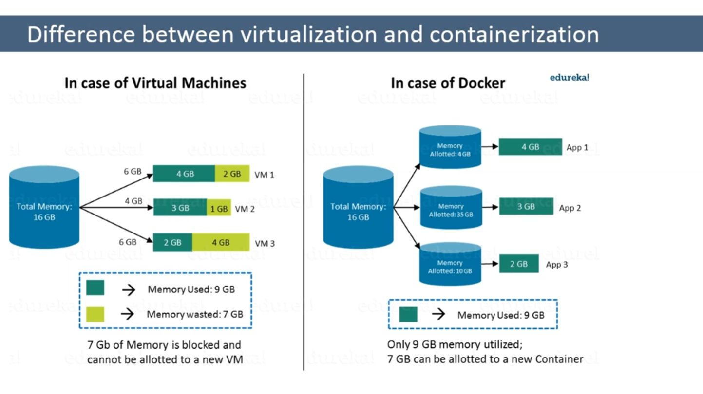

What is hypervisor
    - software that makes virtualization possible
    - virtual machine monitor
    - divides host machine and allocates resources to each of virtual maching environment
    - allows us to have multiple OS on a single host

two types:
    - native/bare
        - no need of server
    - makes use of underlying OS

Virtualization:
    - split one physical system into several virtual components , which acts as separate distinct individual systems.

Containerization:
    - code developed on one maching might not work on other machines , because of dependencies
    - app that is developed and deployed is bundled and wrapped together with all its configuration and dependencies

Diff between containerization and virtualization
    - 
    - in case of vm , unused space is wasted and cant be used for a new vm
    - but in docker containerization, we can set allowed memory and it will only use as per the  need.Remaining memory can be allotted to new container

Docker hub,
    - registry where the docker images live 

docker file
    - docker can build images automatically by reading the instructions from a file called dockerfile.A dockerfile is a text document that contains all the commands a user could call on the command line to assemble an image

docker compose
    - yaml file, containing details about services, networks, volumes for setting up the docker application

Docker swarm
    - turns a pool of docker hosts into a single virtual docker host
    - native clustering for docker


intermediate questions

docker version
    - gives client and server version

how to get the number of containers running, paused and stopped?    
    - docker info
        - number of containers, #running, #paused # stopped ,# images

how to pull an image?
    - docker pull postgres

how to create a container from an image?
    - `docker run -it <image name>`

docker ps
    - command to see the commands that are running

Access a running container?
    - `docker exec -it <container id> bash`
```
docker stop <cid>
docker start <cid>
docker kill <cid>
docker push <username/imagename>
```
- how to delete a stopped container?
    - `docker rm <cid>`

- how to delete an image from local?
    - `docker rmi <image id>`

- how to build docker file?
    - `docker build <path to docker file>`

- `docker system prune`
    - remove all the used to remove all stopped containers, networks,caches,

Advanced Questions
will you loose data when a docker container exists?
    - NO, the prune will delete it though
    - if we delete the container, the corresponding data also will get deleted

Can i use JSON instead of yaml for docker compose file?
    - yes

Can you remove a paused container from docker?
    - No , we cant remove a paused container, The container has to be in stopped state before it can be removed

Can a container restart by itself?
    - no, its not possible by itself, by default the flag -restart is set to false 

Using docker compose in production is the best practical application of docker compose